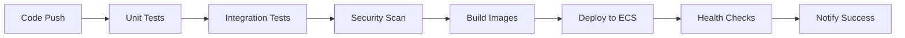

# KIFrag: Conversational AI Agent Assistant

[](https://github.com/your-org/kifrag-deploy/actions)
[](https://opensource.org/licenses/MIT)
[](https://docker.com/)
[](https://aws.amazon.com/ecs/)

## Overview

**KIFrag** is a production-ready, enterprise-grade Conversational AI assistant (Agentic RAG chatbot) designed to enable users to semantically search and retrieve knowledge from both internal proprietary knowledge bases and external web sources. The system leverages advanced LLMs, vector databases, and modern cloud-native technologies to provide a seamless, scalable chat interface for research-intensive workflows.

Built with **microservices architecture**, **containerized deployment**, and **CI/CD automation**, KIFrag is ready for cloud deployment on AWS with enterprise-level security, monitoring, and scalability.


---

## Table of Contents

- [🎯 Project Objectives](#project-objectives)
- [🏗️ System Architecture](#system-architecture)
- [🔧 Microservices](#microservices)
- [🚀 Deployment](#deployment)
  - [Quick Start (Development)](#quick-start-development)
  - [Production Deployment (AWS)](#production-deployment-aws)
- [🔐 Security & Configuration](#security--configuration)
- [📊 Monitoring & Observability](#monitoring--observability)
- [🧪 Testing & Quality Assurance](#testing--quality-assurance)
- [👥 Development & Contribution](#development--contribution)
- [📚 References & Documentation](#references--documentation)

---

## 🎯 Project Objectives

- **Semantic Knowledge Retrieval:** Enable users to query and retrieve information from internal documents, research papers, reports, and technical manuals using natural language.
- **Web Search Integration:** Augment internal knowledge with relevant information from the web.
- **Document Management:** Allow users and admins to upload, index, and manage documents in the knowledge base.
- **Scalable Microservices Architecture:** Ensure each component is independently deployable and maintainable.
- **Production-Ready Deployment:** Containerized services with CI/CD automation for AWS cloud deployment.
- **Enterprise Security:** Multi-layered security with AWS Secrets Manager, IAM roles, and container security.
- **High Availability:** Load-balanced, auto-scaling infrastructure with health monitoring.

### 💡 Impact
Reduce research time by **70%** and help users find more contextually and semantically relevant knowledge with minimal effort compared to manual reading and research processes.

---

## 🏗️ System Architecture


📋 [Detailed System Architecture Documentation](assets/detailed_system_architetcure.pdf)

KIFrag follows a **cloud-native microservices architecture** optimized for AWS deployment. Each component is containerized, independently scalable, and follows enterprise security best practices.

### 🏗️ Core Infrastructure Components:
- **🌐 Application Load Balancer (ALB):** Routes traffic with SSL termination and health checks
- **🐳 Amazon ECS:** Container orchestration with auto-scaling capabilities  
- **🔐 AWS Secrets Manager:** Centralized secrets management for API keys and credentials
- **📊 CloudWatch:** Comprehensive logging, monitoring, and alerting
- **🗄️ Amazon ECR:** Private container registry for secure image storage
- **🌐 VPC:** Isolated network with public/private subnets for security

### 🔧 Application Services:
- **Frontend (Nginx):** Production-optimized React application with content delivery
- **API Gateway:** Central routing hub with request/response management
- **Agent Service:** AI orchestration engine with LangChain and LangGraph
- **Indexing Service:** Document processing and vector database management
- **Vector Database (Pinecone):** Semantic search and embedding storage

---

## 🔧 Microservices

### 🤖 1. Agent Service
- **Port:** 8001 | **Health Check:** `/health`
- **Description:** Core AI reasoning engine with ReAct agents for intelligent knowledge retrieval
- **Tech Stack:** FastAPI, LangChain, LangGraph, Python 3.10
- **Production Features:**
  - ✅ Multi-stage Docker builds for optimized images
  - ✅ Non-root container execution for security
  - ✅ Structured logging with CloudWatch integration
  - ✅ Health monitoring and auto-recovery
  - ✅ Resource limits and auto-scaling

### 🌐 2. API Gateway  
- **Port:** 8000 | **Health Check:** `/health`
- **Description:** Enterprise API gateway with request routing, validation, and orchestration
- **Tech Stack:** FastAPI, Python, Aiohttp, Pydantic
- **Production Features:**
  - ✅ Request/response validation and transformation
  - ✅ Service discovery and load balancing
  - ✅ Rate limiting and security headers
  - ✅ CORS configuration for production domains
  - ✅ Circuit breaker patterns for resilience

### 📚 3. Indexing Service
- **Port:** 8002 | **Health Check:** `/health`  
- **Description:** Document processing pipeline with intelligent chunking and vector embedding
- **Tech Stack:** FastAPI, LangChain, Pinecone, Sentence Transformers
- **Production Features:**
  - ✅ Async document processing for high throughput
  - ✅ Multi-format support (PDF, DOCX, TXT)
  - ✅ Vector embedding optimization
  - ✅ Error handling and retry mechanisms
  - ✅ Processing queue management

### 🖥️ 4. Frontend
- **Port:** 80 (Nginx) | **Health Check:** `/`
- **Description:** Production-ready React SPA with optimized delivery and caching
- **Tech Stack:** React, TypeScript, Vite, Nginx, Tailwind CSS
- **Production Features:**
  - ✅ Nginx reverse proxy with compression
  - ✅ Static asset caching and CDN optimization  
  - ✅ Security headers (CSP, HSTS, X-Frame-Options)
  - ✅ Progressive Web App (PWA) capabilities
  - ✅ Error boundaries and graceful degradation

---

## 🚀 Deployment

### Quick Start (Development)

🔧 **Prerequisites:** Docker, Docker Compose, Git

1. **Clone and Setup:**
   ```bash
   git clone https://github.com/your-org/kifrag-deploy.git
   cd kifrag-deploy
   ```

2. **Configure Environment Variables:**
   ```bash
   # Copy example environment files for each service
   cp agent_service/.env.example agent_service/.env
   cp api_gateway/.env.example api_gateway/.env  
   cp indexing_service/.env.example indexing_service/.env
   cp frontend/.env.example frontend/.env
   
   # Edit each .env file with your API keys and configuration
   ```

3. **Start All Services:**
   ```bash
   docker-compose up --build
   ```

4. **Access the Application:**
   - 🌐 **Frontend:** http://localhost:80
   - 🔗 **API Gateway:** http://localhost:8000/docs
   - 🤖 **Agent Service:** http://localhost:8001/docs
   - 📚 **Indexing Service:** http://localhost:8002/docs

### Production Deployment (AWS)

🚀 **Full production deployment with CI/CD automation**

#### Prerequisites:
- AWS Account with ECS, ECR, VPC permissions
- GitHub repository with Actions enabled
- Terraform installed locally

#### 1. Infrastructure Setup:
```bash
cd terraform
terraform init
terraform workspace new production
terraform apply -var="environment=production"
```

#### 2. Configure GitHub Secrets:
Add these secrets to your GitHub repository:
```
AWS_ACCESS_KEY_ID=your-aws-access-key
AWS_SECRET_ACCESS_KEY=your-aws-secret-key  
SLACK_BOT_TOKEN=your-slack-bot-token (optional)
```

#### 3. Deploy via GitHub Actions:
- Push to `main` branch triggers automatic deployment
- Or manually trigger via GitHub Actions UI
- Monitor deployment status in Actions tab

#### 4. Verification:
```bash
# Check ECS services
aws ecs list-services --cluster kifrag-production-cluster

# View application logs  
aws logs describe-log-groups --log-group-name-prefix "/ecs/kifrag"
```

📋 **Detailed AWS Deployment Guide:** [docs/aws-deployment.md](docs/aws-deployment.md)

---

## 🔐 Security & Configuration

### 🔐 Environment Configuration

**🚨 Security First:** Never commit sensitive credentials to version control!

Each microservice uses environment-specific configuration:

#### Agent Service (`.env`):
```bash
# AI Model Configuration
AGENT_LLM=meta-llama/Llama-3.3-70B-Instruct-Turbo-Free
MODEL_PROVIDER=together
TOGETHER_API_KEY=your-together-api-key

# Vector Database
PINECONE_API_KEY=your-pinecone-key
PINECONE_INDEX_NAME=kifrag-knowledge-base

# Environment
ENVIRONMENT=production
```

#### Indexing Service (`.env`):
```bash
# Vector Database Configuration
PINECONE_API_KEY=your-pinecone-key
PINECONE_INDEX_NAME=kifrag-knowledge-base
ENVIRONMENT=production
```

#### API Gateway (`.env`):
```bash
# Service Discovery
AGENT_SERVICE_URL=http://agent-service:8001/agent_respond/
INDEXING_SERVICE_URL=http://indexing-service:8002/index_document/
ENVIRONMENT=production
```

#### Frontend (`.env`):
```bash
# API Configuration (build-time variable)
VITE_API_GATEWAY_URL=https://api.yourdomain.com
```

### 🛡️ Production Security Features:
- **AWS Secrets Manager:** Centralized secret management in production
- **IAM Roles:** Least-privilege access with temporary credentials
- **VPC Isolation:** Private subnets for backend services
- **Security Groups:** Network-level access control
- **Container Security:** Non-root execution, minimal base images
- **SSL/TLS:** End-to-end encryption with AWS Certificate Manager

---

## 📊 Monitoring & Observability

### 🔍 Built-in Monitoring:
- **Health Checks:** All services expose `/health` endpoints
- **CloudWatch Logs:** Centralized logging with structured JSON format
- **CloudWatch Metrics:** Custom metrics for business intelligence
- **ECS Container Insights:** Resource utilization and performance
- **Application Load Balancer Metrics:** Request patterns and latency

### 📈 Key Metrics Dashboard:
- Request volume and response times
- Error rates and failure patterns  
- Resource utilization (CPU, Memory, Network)
- Database connection health
- Vector search performance

### 🚨 Alerting:
- High error rates (>5% for 5 minutes)
- Service unavailability
- Resource exhaustion
- Slow response times (>2s p95)

---

## 🧪 Testing & Quality Assurance

### 🔄 CI/CD Pipeline:


### ✅ Test Coverage:
- **Unit Tests:** Individual service logic testing
- **Integration Tests:** Service-to-service communication
- **Contract Tests:** API compatibility validation
- **Load Tests:** Performance under stress
- **Security Tests:** Vulnerability scanning

### 🔒 Code Quality:
- **Linting:** Python (flake8, black), TypeScript (ESLint)
- **Type Checking:** mypy for Python, TypeScript strict mode
- **Security Scanning:** Container vulnerability analysis
- **Dependency Scanning:** Automated security updates

---

## 👥 Development & Contribution

### 🛠️ Development Workflow:

1. **Setup Development Environment:**
   ```bash
   git clone https://github.com/your-org/kifrag-deploy.git
   cd kifrag-deploy
   
   # Install development dependencies
   pip install -r requirements-dev.txt  # For Python services
   npm install  # For frontend
   ```

2. **Create Feature Branch:**
   ```bash
   git checkout -b feature/your-feature-name
   ```

3. **Development with Hot Reload:**
   ```bash
   # Start individual services for development
   cd agent_service && uvicorn agent_service_app:app --reload
   cd api_gateway && uvicorn api_gateway_app:app --reload --port 8000
   cd frontend && npm run dev
   ```

4. **Testing & Quality Checks:**
   ```bash
   # Run tests
   pytest agent_service/tests/
   pytest api_gateway/tests/
   
   # Code formatting
   black . && flake8
   
   # Security checks
   bandit -r .
   ```

5. **Submit Pull Request:**
   - Ensure all tests pass
   - Add documentation for new features
   - Include performance impact analysis
   - Request code review from maintainers

### 📋 Contribution Guidelines:
- Follow [Conventional Commits](https://conventionalcommits.org/) specification
- Maintain test coverage above 80%
- Document all public APIs with OpenAPI/Swagger
- Performance changes require benchmark comparisons
- Security changes require threat model updates

---

## 📚 References & Documentation

### 🔗 Technical Documentation:
- [🏗️ AWS Deployment Guide](docs/aws-deployment.md)
- [🔧 API Documentation](http://localhost:8000/docs) (when running locally)
- [🏛️ System Architecture Deep Dive](assets/detailed_system_architetcure.pdf)
- [🔐 Security Best Practices](docs/security.md)

### 📖 External Resources:
- [LangChain Documentation](https://python.langchain.com/) - AI framework
- [FastAPI Documentation](https://fastapi.tiangolo.com/) - API framework  
- [Pinecone Documentation](https://docs.pinecone.io/) - Vector database
- [AWS ECS Documentation](https://docs.aws.amazon.com/ecs/) - Container orchestration
- [Terraform AWS Provider](https://registry.terraform.io/providers/hashicorp/aws/) - Infrastructure as Code

### 🎯 Performance Benchmarks:
- **Response Time:** <500ms p95 for simple queries
- **Throughput:** 1000+ concurrent users supported
- **Availability:** 99.9% uptime SLA
- **Scalability:** Auto-scales from 2-50 instances based on load

### 📞 Support & Community:
- **Issues:** [GitHub Issues](https://github.com/your-org/kifrag-deploy/issues)
- **Discussions:** [GitHub Discussions](https://github.com/your-org/kifrag-deploy/discussions)  
- **Security:** security@yourdomain.com
- **Documentation:** [Wiki](https://github.com/your-org/kifrag-deploy/wiki)

---

## 📄 License

This project is licensed under the **MIT License** - see the [LICENSE](LICENSE) file for details.

---

**🚀 Ready to deploy? Start with our [AWS Deployment Guide](docs/aws-deployment.md)**

**💬 Questions or feedback? [Open an issue](https://github.com/your-org/kifrag-deploy/issues) or reach out to our team!**
