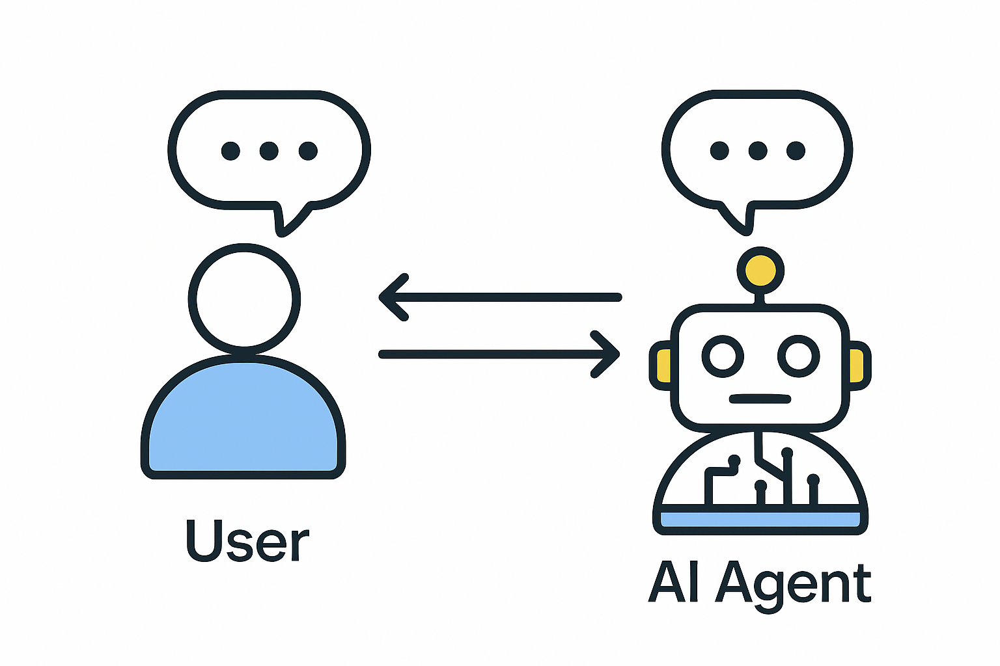
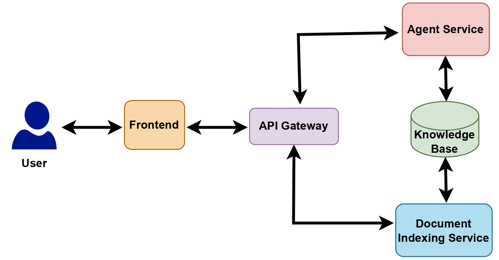

# KIFrag: Conversational AI Agent Assistant



## Overview

**KIFrag** is a Conversational AI assistant (Agentic RAG chatbot) designed to enable users to semantically search and retrieve knowledge from both internal proprietary knowledge bases and external web sources. The system leverages advanced LLMs, vector databases, and modern web technologies to provide a seamless chat interface for research-intensive workflows. This project is organised as a microservices architecture with multiple core services.


---

## Table of Contents

- [Project Objectives](#project-objectives)
- [System Architecture](#system-architecture)
- [Microservices](#microservices)
  - [Agent Service](#agent-service)
  - [API Gateway](#api-gateway)
  - [Indexing Service](#indexing-service)
  - [Frontend](#frontend)
- [Deployment](#deployment)
- [Environment Variables](#environment-variables)
- [Development & Contribution](#development--contribution)
- [License](#license)
- [References](#references)

---

## Project Objectives

- **Semantic Knowledge Retrieval:** Enable users to query and retrieve information from internal documents, research papers, reports, and technical manuals using natural language.
- **Web Search Integration:** Augment internal knowledge with relevant information from the web.
- **Document Management:** Allow users and admins to upload, index, and manage documents in the knowledge base.
- **Scalable Microservices Architecture:** Ensure each component is independently deployable and maintainable.
- **Production-Ready Deployment:** Containerized services for cloud deployment and CI/CD integration.

### Impact: 
Reduce research time and help users to find more contextually and semantically relevant and rich knowledge and content with less efforts compared to manual reading and researching.

---

## System Architecture



[Detailed system architecture](assets/detailed_system_architetcure.pdf)

The KIFrag system follows a microservices architecture, with each main component running as an independent service. The architecture ensures scalability, maintainability, and ease of deployment.

**Main Components:**
- **Frontend:** Interactive chat interface for users.
- **API Gateway:** Routes requests between frontend and backend services.
- **Agent Service:** Core AI logic, orchestrating LLMs and tools for knowledge retrieval and web search.
- **Indexing Service:** Handles document ingestion and indexing into the vector database.
- **Vector Database:** (e.g., Pinecone) Stores document embeddings for semantic search.

---

## Microservices

### 1. Agent Service

- **Description:** Hosts the core ReAct agent, connects to LLM APIs, and provides tools for knowledge retrieval (RAG) and web search.
- **Tech Stack:** FastAPI, LangChain, LangGraph, Python
- **Key Features:**
  - Semantic search via vector DB
  - Web search integration
  - LLM orchestration

### 2. API Gateway

- **Description:** Central entry point for all client requests, routing them to the appropriate backend service.
- **Tech Stack:** FastAPI, Python, Aiohttp
- **Key Features:**
  - Request/response routing
  - Service discovery and orchestration

### 3. Indexing Service

- **Description:** Handles document uploads and indexes them into the vector database for semantic retrieval.
- **Tech Stack:** FastAPI, LangChain, Pinecone, Python
- **Key Features:**
  - Document ingestion
  - Embedding generation
  - Vector DB indexing

### 4. Frontend

- **Description:** JavaScript-based chat interface for user interaction and document management.
- **Tech Stack:** JavaScript, Vite, HTML, CSS
- **Key Features:**
  - Real-time chat with AI agent
  - Document upload and management

---

## Deployment

All services are containerized using Docker. The system can be orchestrated using `docker-compose` for local development or deployed to the cloud via CI/CD pipelines (Jenkins, GitHub Actions).

### Quick Start (Development)

1. **Clone the repository:**
    ```bash
    git clone https://github.com/your-org/KIFrag.git
    cd KIFrag
    ```

2. **Set up environment variables:**
    - Copy `.env.example` to `.env` in each service directory and fill in required values.

3. **Build and run all services:**
    ```bash
    docker-compose up --build
    ```

4. **Access the frontend:**
    - Visit [http://localhost:5173](http://localhost:5173) (or the port specified in your frontend Dockerfile).

### Cloud Deployment
Each microservice is containerised (with Docker) and can be run in a cloud environment. Complete deployment is run via CI/CD pipeline with Jenkins (for internal servers) or Github actions to deploy to production in AWS or Azure cloud environment using CI/CD configuration YAML [file](.github/workflows/ci-cd.yml)

---

## Environment Variables

Each microservice requires its own `.env` file with relevant configuration. **Do not commit sensitive keys to version control.**

**Example for `agent_service/.env`:**
```
OPENROUTER_API_KEY=your-openrouter-key
AGENT_SERVICE_URL=http://agent_service:8001/agent/reply
```

**Example for `indexing_service/.env`:**
```
PINECONE_API_KEY=your-pinecone-key
PINECONE_INDEX_NAME=kifrag-knowledge-base
```

**Example for `api_gateway/.env`:**
```
INDEXING_SERVICE_URL=http://indexing_service:8002/index_document/
```

---

## Development & Contribution

1. Fork the repository and create your feature branch.
2. Commit your changes and open a pull request.
3. Ensure all new code is covered by unit tests.
4. Follow the code style and contribution guidelines.

---

## License

This project is licensed under the MIT License. See the [LICENSE](LICENSE) file for details.

---

## References

- [LangChain Documentation](https://python.langchain.com/)
- [FastAPI Documentation](https://fastapi.tiangolo.com/)
- [Pinecone Documentation](https://docs.pinecone.io/)
- [Vite Documentation](https://vitejs.dev/)
- [System Architecture Diagram](documentation/Chat Application System Architetcure Design.pdf)

---

**Contact:**  
For questions or support, please open an issue or contact the maintainers.
